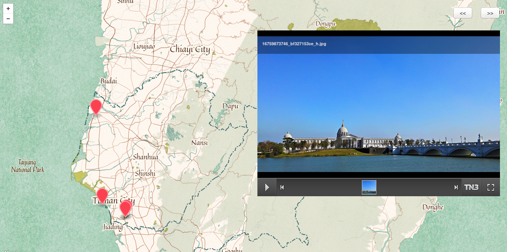
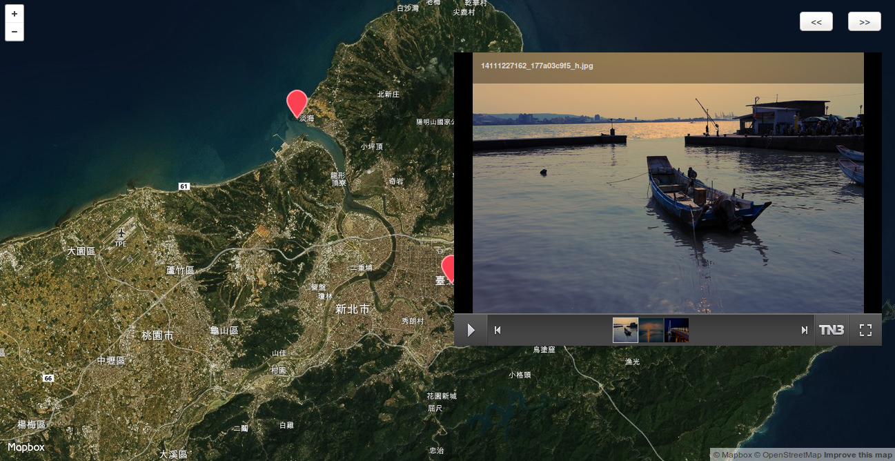
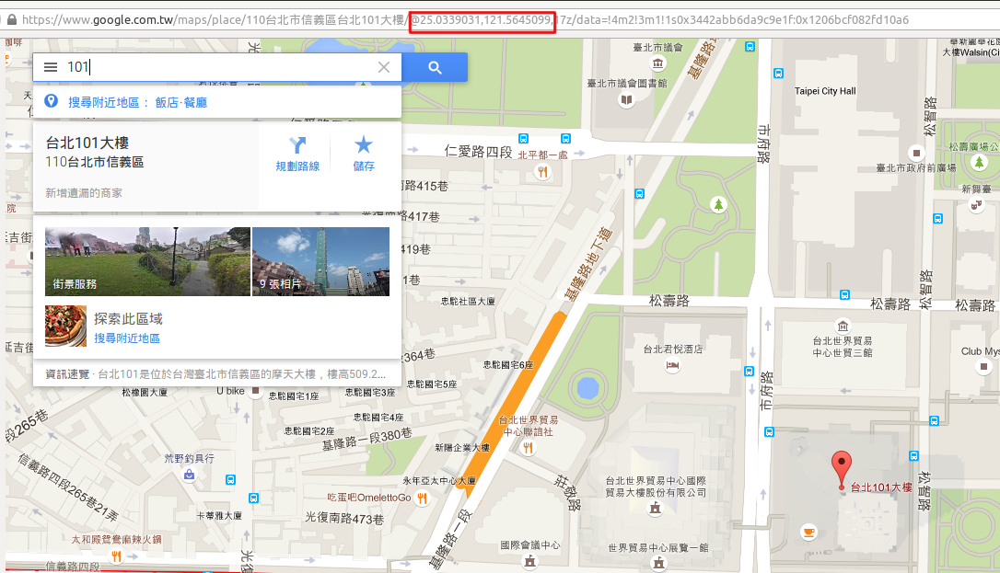

DLM - Draw Life Map
===================

一個將地圖結合相簿來呈現照片的網頁。
以前常去很多地方拍很多照片，但發現只把照片分成很多個資料夾放，實在無法呈現出那種征服(?)很多地方的感覺。
像是環島，我們會希望依照在每個鄉鎮拍的照片，標記在地圖對應的地理位置上呈現，這樣的話看地圖上很多地方都被我標記過，感覺就很爽！





Feature
-------

- **地圖相簿**：可以把好幾個地點的照片集合成一個地圖相簿。一張地圖上可以標記很多地理位置，每個地理位置就是一個你的相簿
- **畫廊照片呈現**：使用 [TN3 gallery](http://www.tn3gallery.com/features/)，讓照片簡單呈現且方便瀏覽
- **屬於自己的地圖風格**：地圖使用 [mapbox](https://www.mapbox.com/maps/) 來製作，讓每張地圖可以以各種風格呈現！
- **地圖集**：每張地圖相簿可依照自己喜好使用不同的地圖風格，並使用 [page-scroll effects](http://codyhouse.co/gem/page-scroll-effects/) 集合每個地圖相簿，在首頁上輕鬆滾動選擇
- **無須後端程式架設**：不須額外使用後端程式讀取本地照片，只需在照片整理完後，點擊 shell script 即可

How to use
----------

1. 建立地圖
    在 photo/ 裡建立一個資料夾，取名叫 map1 (或是任意你想取的名字)，並且挑選一張適合 map1 的主題照片，放在 map1/ 裡，並更名為 index.jpg

2. 建立相簿
    在 map1/ 裡建立一個資料夾，取名叫 somewhere-22.9347833,120.2260679 (或是任意你想取的名字)，
    不過請注意 **資料夾名稱不能有空白**，且格式須依照
    > [相簿名字]-[緯度],[經度]

    - 找座標小技巧
        1. 可以在 google 搜尋輸入你要的地點，然後網址列上就會有經緯度
            
        2. google map 上要找的地點按右鍵，選擇`這是哪裡？`，下方就會出現該地點的經緯度，複製時請注意 **資料夾名稱不能有空白**

3. 執行 shell script
    - Windows 系統：雙擊 getDir.bat
    - Linux 系統： chmod +x ./getDir.sh; ./getDir.sh

4. 打開 index.html，然後就可以選擇地圖瀏覽啦！

Photo/ Structure
----------------

目前照片支援 jpg、bmp、gif、png 檔，
photo 資料夾結構如下：
```
./photo
├── [mapName]
│   ├── [title]-[lat],[lng]
│   │   ├── [photo].jpg
│   │   ├── [photo].bmp
│   │   ├── [photo].gif
│   │   └── [photo].png
│   ├── [title2]-[lat],[lng]
│   │   └── ......
│   └── index.jpg
├── [mapName2]
│   └── . . .
└── index.jpg
```

Optional
--------

- 在地圖內可點擊右上方 `<<` 和 `>>` 來增減呈現的相簿
想要依照特殊排序的話，只要在建立相簿資料夾上作編號即可
> 1.奇美博物館-22.9347833,120.2260679
> 2.台南夕陽-22.976125,120.144791

- custom options
編輯 index.html，裡面從 `/* custom options */` 開始，可以設定
    - dir
        字串，讀取的照片的位置，預設為 photo，若要更改還需改 shell script，不建議修改
    - token
        字串，讀取 mapbox api 所需的 token，可自行辦 mapbox 帳號使用自己的 token
    - mapboxIdList
        字串陣列，裡面代表每個地圖所要用的 mapbox id，官方風格的 id 可以從[這裡](https://www.mapbox.com/maps/)取得
    - view
        陣列，儲存的值是一個經緯度的陣列 [lat, lng]，代表每個地圖最初讀取時的的中心位置
    - zoom
        整數，代表地圖最初讀取時的縮放大小

Future Work
-----------

- 除了照片之外還可以有文字介紹
- 獨立管理 相簿名稱和地理位置，GUI 讓使用者直接輸入和管理每個相簿和地裡位置的對應

Source
------

照片出處

[./photo/index.jpg](https://www.flickr.com/photos/balmung1983/8527454205/)
[./photo/台北/index.jpg](https://www.flickr.com/photos/kyleme/2153452223/)
[./photo/台北/101-25.0339031,121.5645098/19472808621_32a2010a89_k.jpg](https://www.flickr.com/photos/tsaiian/19472808621/)
[./photo/台北/101-25.0339031,121.5645098/3189962915_38767a4c0a_b.jpg](https://www.flickr.com/photos/jaako/3189962915/)
[./photo/台北/淡水-25.182295,121.410882/14111227162_177a03c9f5_h.jpg](https://www.flickr.com/photos/55968326@N08/14111227162/)
[./photo/台北/淡水-25.182295,121.410882/18163646668_d9b1349398_h.jpg](https://www.flickr.com/photos/eternal_ray/18163646668/)
[./photo/台北/淡水-25.182295,121.410882/623489688_e0728ce64b_b.jpg](https://www.flickr.com/photos/neojet0411/623489688/)
[./photo/台南/index.jpg](https://www.flickr.com/photos/eternal_ray/12483269983/)
[./photo/台南/1.奇美博物館-22.9347833,120.2260679/16759873746_bf327153ce_h.jpg](https://www.flickr.com/photos/hcj0416/16759873746/)
[./photo/台南/2.台南夕陽-22.976125,120.144791/14457208178_6177f0508d_h.jpg](https://www.flickr.com/photos/eternal_ray/14457208178/)
[./photo/台南/3.北門水晶教堂-23.2640082,120.1227249/19366470194_1f29a6d371_h.jpg](https://www.flickr.com/photos/p930802/19366470194/)
[./photo/台南/4.十鼓文化村-22.9393017,120.2299523/13687300865_c1785108b1_h.jpg](https://www.flickr.com/photos/speedbug/13687300865/)
